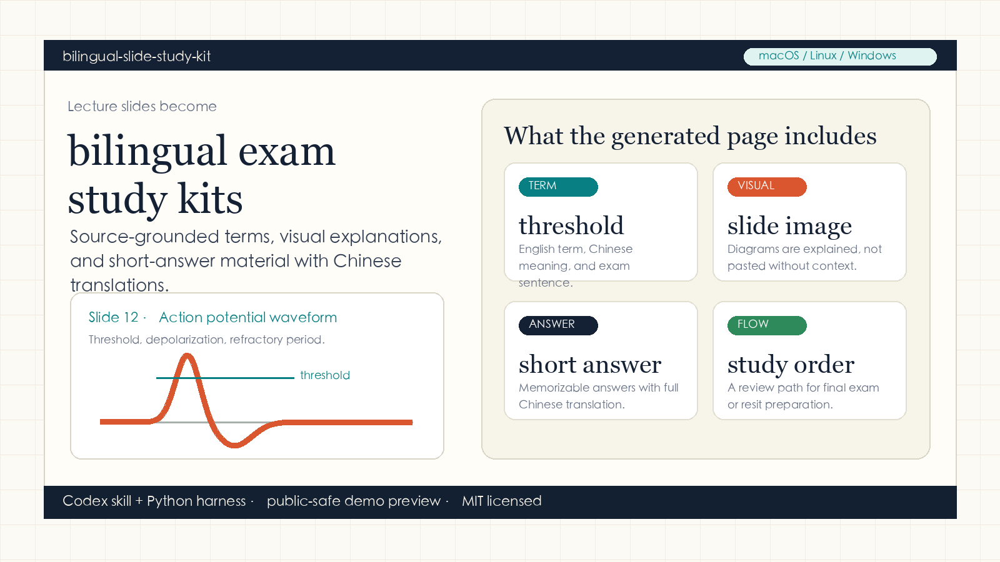
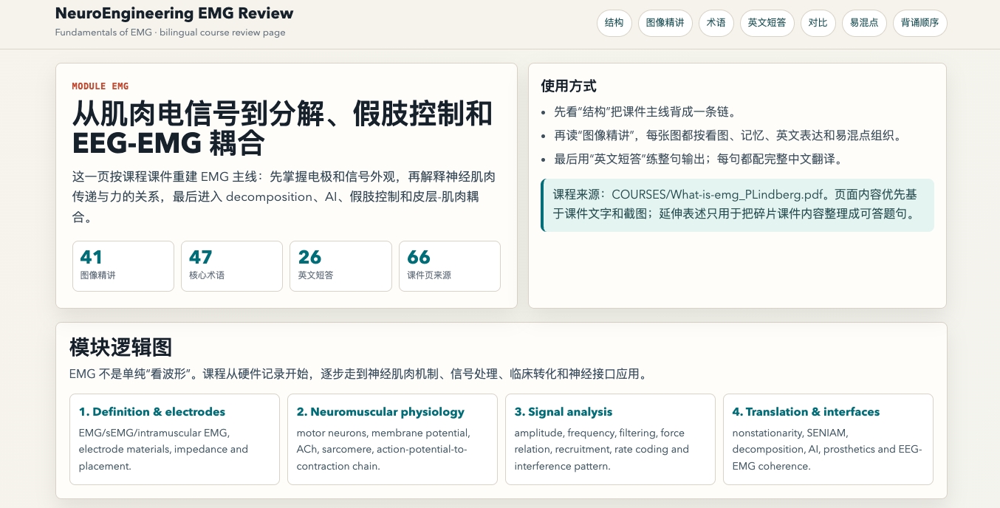
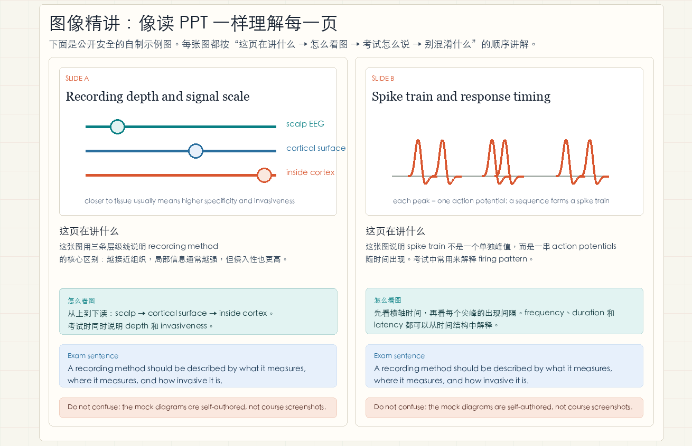
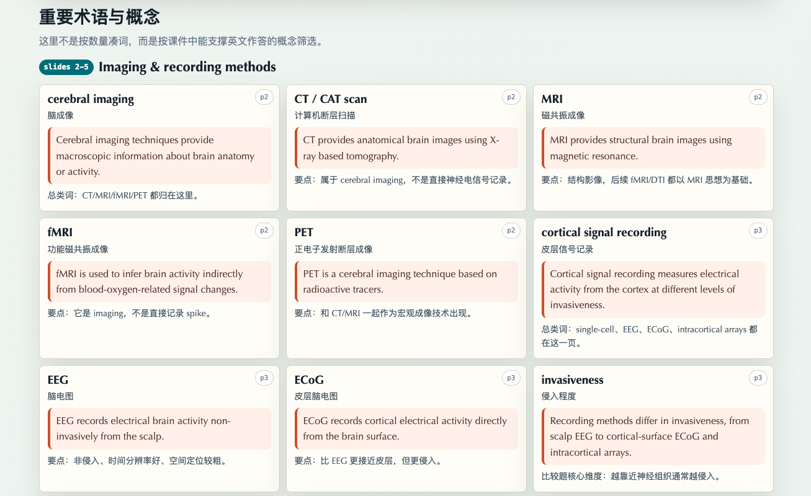
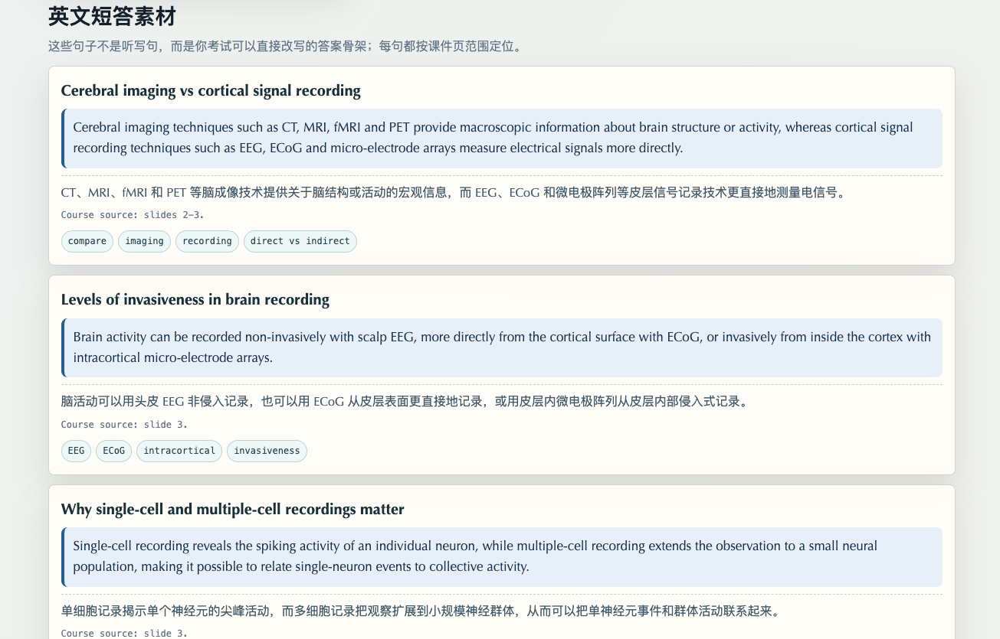
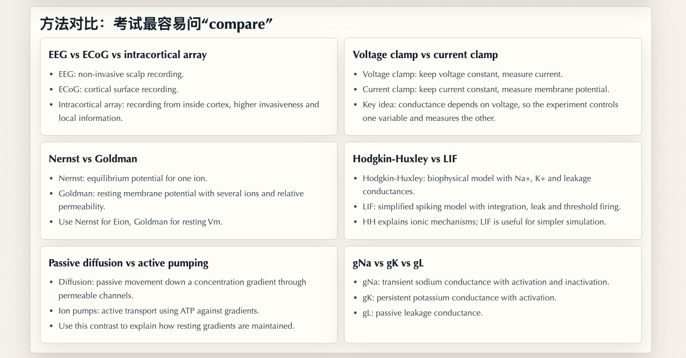

# bilingual-slide-study-kit

Language: **English** | [简体中文](README.zh-CN.md)

[](https://github.com/Misakakuroko/bilingual-slide-study-kit/actions/workflows/ci.yml)
[](LICENSE)
[](pyproject.toml)

Turn lecture slides into bilingual, exam-ready HTML study kits.

`bilingual-slide-study-kit` is a reusable Codex skill plus a deterministic slide-asset harness. It is built for students who study technical courses in a second language and need more than a summary: terminology, source-grounded explanations, exam-style English answers, Chinese translations, and visual memory aids from the original slides.

It is not a generic PPT-to-HTML converter. The goal is to turn a lecture PDF into a study page that helps a student understand the material, memorize the right terms, and write better exam answers.



Live demo:
[misakakuroko.github.io/bilingual-slide-study-kit/examples/demo.html](https://misakakuroko.github.io/bilingual-slide-study-kit/examples/demo.html)

The demo is self-authored and public-safe. It does not use private course material.

## Case Gallery

The images below show the intended review-page experience in order. The second visual-explanation screenshot is a public-safe replacement that uses self-authored mock diagrams instead of real PPT pages.

### 1. Module Overview



### 2. Visual Explanation



### 3. Terminology Cards



### 4. Exam-Ready Short Answers



### 5. Method Comparison



## Why This Exists

Many students do not fail technical courses because they are incapable of understanding the science. They struggle because the lecture slides, technical vocabulary, and expected exam wording are all in a second language.

This project packages a workflow for turning those slides into a bilingual study kit that can be reviewed on desktop or mobile.

## What It Creates

For each lecture module, the workflow can produce a standalone HTML review page with:

- a slide-range logic map,
- selected PPT/PDF screenshots,
- detailed explanations of important diagrams,
- important terminology with Chinese support,
- exam-ready English short-answer material,
- full Chinese translations of English answer sentences,
- method comparisons,
- common confusions and misconceptions,
- a memorization order for final exam or resit preparation.

## Supported Platforms

The project is cross-platform. It is a Python harness plus a Codex skill, not a macOS-only app.

| Platform | Status | Notes |
| --- | --- | --- |
| macOS | Supported | Best tested. Uses `sips` for optional image resizing when available. |
| Linux | Supported | Tested through CI for the Python harness. |
| Windows | Supported | Requires Python and Poppler command-line tools in `PATH`. |

## Quick Start

### 1. Install Requirements

You need Python 3.10+ and Poppler command-line tools:

- `pdfinfo`
- `pdftotext`
- `pdftoppm`

macOS:

```bash
brew install poppler
```

Ubuntu/Debian:

```bash
sudo apt-get update
sudo apt-get install poppler-utils
```

Windows PowerShell:

```powershell
winget install Python.Python.3.12
winget install oschwartz10612.Poppler
```

After installing Poppler on Windows, open a new terminal and check:

```powershell
pdfinfo -v
pdftotext -v
pdftoppm -v
```

If those commands are not found, add Poppler's `Library\bin` or `bin` folder to your Windows `PATH`.

### 2. Install The Codex Skill

Clone the repository:

```bash
git clone https://github.com/Misakakuroko/bilingual-slide-study-kit.git
cd bilingual-slide-study-kit
```

macOS/Linux:

```bash
mkdir -p ~/.codex/skills
cp -R skills/course-ppt-review-html ~/.codex/skills/
```

Windows PowerShell:

```powershell
New-Item -ItemType Directory -Force "$env:USERPROFILE\.codex\skills"
Copy-Item -Recurse ".\skills\course-ppt-review-html" "$env:USERPROFILE\.codex\skills\"
```

Start a new Codex session and invoke:

```text
Use $course-ppt-review-html to turn this lecture PDF into an exam-ready bilingual HTML review page with detailed slide explanations.
```

You can also use a short natural-language request:

```text
Generate a review HTML page for the Signal Processing course.
Turn this PPT into an exam-ready review HTML page.
Create a bilingual study page for this module.
```

### 3. Prepare Slide Assets

The harness extracts slide text, selected slide screenshots, a manifest, and reusable HTML snippets.

macOS/Linux:

```bash
python3 scripts/prepare_ppt_review_assets.py \
  --pdf "/path/to/lecture.pdf" \
  --output-dir "./out/module_assets" \
  --prefix "module" \
  --pages "3,4,7-10,13,16-18,20-21" \
  --clean
```

Windows PowerShell:

```powershell
py -3 .\scripts\prepare_ppt_review_assets.py `
  --pdf "C:\path\to\lecture.pdf" `
  --output-dir ".\out\module_assets" `
  --prefix "module" `
  --pages "3,4,7-10,13,16-18,20-21" `
  --clean
```

Outputs:

- `module_slides_text.txt`
- `module_manifest.json`
- `module-slide-03.jpg` etc.
- `module_visual_snippets.html`

### 4. Render and Audit a Fixed-Quality Page

To prevent the final page from drifting into a plain summary, use the spec -> render -> audit workflow. Codex fills the knowledge content in JSON; the harness owns the stable page structure and quality gate.

```bash
python3 scripts/build_review_page.py init-spec \
  --manifest "./out/module_assets/module_manifest.json" \
  --image-base "module_assets" \
  --course-title "Course Name" \
  --module-title "Module Name" \
  --output "./out/module.review-spec.json"
```

After completing `module.review-spec.json`:

```bash
python3 scripts/build_review_page.py validate-spec --spec "./out/module.review-spec.json"
python3 scripts/build_review_page.py render --spec "./out/module.review-spec.json" --output "./out/module.html"
python3 scripts/build_review_page.py audit --html "./out/module.html"
```

The audit checks navigation, detailed visual explanations, term cards, English answer cards, Chinese translations, source labels, and broken images. A page with no `.term-card`, `.answer-card`, `.explain-item`, or `.exam-line` fails.

## Example Prompt

```text
Use $course-ppt-review-html to generate final review HTML pages for these modules.

Course directory:
/path/to/course

Modules:
1. Recording Brain Activity: /path/to/recording.pdf
2. EMG: /path/to/emg.pdf
3. TMS: /path/to/tms.pdf

Requirements:
- Do not impose a fixed number of terms or short answers.
- Include every concept that helps exam performance.
- Add detailed explanations for important PPT images.
- For each slide image, explain what it teaches, how to read it, what to remember, an exam-ready English sentence, and one common misconception.
- English short answers must have full Chinese sentence translations.
- Prioritize slide-grounded content and label slide sources.
- Verify mobile readability and broken images.
```

## Repository Layout

```text
bilingual-slide-study-kit/
├── README.md
├── README.zh-CN.md
├── LICENSE
├── pyproject.toml
├── scripts/
│   ├── prepare_ppt_review_assets.py
│   └── build_review_page.py
├── skills/
│   └── course-ppt-review-html/
│       ├── SKILL.md
│       ├── agents/openai.yaml
│       ├── references/review-page-criteria.md
│       └── scripts/
│           ├── prepare_ppt_review_assets.py
│           └── build_review_page.py
├── templates/
│   └── visual-card.html
├── examples/
│   ├── README.md
│   ├── case-01-overview.png
│   ├── case-02-visual-explanation.png
│   ├── case-03-terminology.png
│   ├── case-04-short-answers.png
│   ├── case-05-comparison.png
│   ├── demo.html
│   └── demo-preview.png
└── tests/
    ├── test_prepare_ppt_review_assets.py
    └── test_build_review_page.py
```

## Design Principles

- Source grounded: label whether content comes from slides, generated reasoning, or user-provided material.
- Exam oriented: every explanation should help with recall, comparison, or answer writing.
- Bilingual by default: English exam sentences should include full Chinese translations.
- Visual memory first: important diagrams should be explained, not merely embedded.
- Privacy aware: course PDFs, copyrighted screenshots, and personal paths should stay out of the repository.

## Copyright And Privacy

Do not commit course PDFs, copyrighted slide screenshots, generated review pages based on private course material, or personal paths. The `.gitignore` excludes common slide and generated asset files by default.

For a public demo, use self-authored or openly licensed slides.

## License

MIT License.
